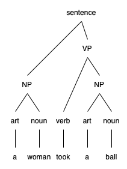
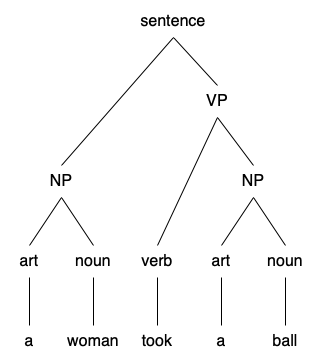
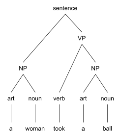
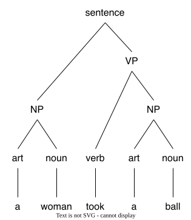

# diagrams test

## 12pt png
This corresponds to the tree that linguists draw as in figure 2.1.

|  |
|---|
|  |
| **Figure 2.1: Sentence Parse Tree** |

Using the "straightforward functions" approach we would be stuck; we'd have to rewrite every function to generate the additional structure.

## 16pt png
This corresponds to the tree that linguists draw as in figure 2.1.

|  |
|---|
|  |
| **Figure 2.1: Sentence Parse Tree** |

Using the "straightforward functions" approach we would be stuck; we'd have to rewrite every function to generate the additional structure.

## svg, embedded font
This corresponds to the tree that linguists draw as in figure 2.1.

|  |
|---|
|  |
| **Figure 2.1: Sentence Parse Tree** |

Using the "straightforward functions" approach we would be stuck; we'd have to rewrite every function to generate the additional structure.

## svg, text converted to svg
> I *think* this changes text to lines and curves

This corresponds to the tree that linguists draw as in figure 2.1.

|  |
|---|
|  |
| **Figure 2.1: Sentence Parse Tree** |

Using the "straightforward functions" approach we would be stuck; we'd have to rewrite every function to generate the additional structure.

## svg, text converted to svg, via inkscape
> I *think* this changes text to lines and curves

This corresponds to the tree that linguists draw as in figure 2.1.

|  |
|---|
|  |
| **Figure 2.1: Sentence Parse Tree** |

Using the "straightforward functions" approach we would be stuck; we'd have to rewrite every function to generate the additional structure.

## svg, text converted to svg, via rsvg / librsvg
> I *hope* this changes text to lines and curves

This corresponds to the tree that linguists draw as in figure 2.1.

|  |
|---|
|  |
| **Figure 2.1: Sentence Parse Tree** |

Using the "straightforward functions" approach we would be stuck; we'd have to rewrite every function to generate the additional structure.
