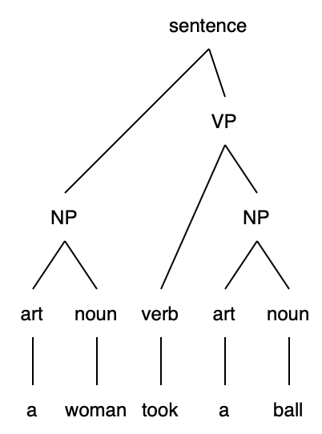
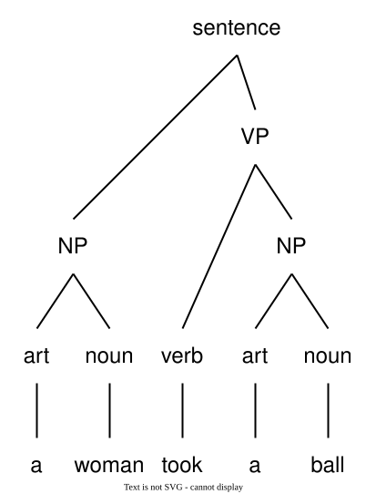

# diagrams test

## original
This corresponds to the tree that linguists draw as in figure 2.1.

|  |
|---|
|  |
| **Figure 2.1: Sentence Parse Tree** |

Using the "straightforward functions" approach we would be stuck; we'd have to rewrite every function to generate the additional structure.

## png
This corresponds to the tree that linguists draw as in figure 2.1.

|  |
|---|
|  |
| **Figure 2.1: Sentence Parse Tree** |

Using the "straightforward functions" approach we would be stuck; we'd have to rewrite every function to generate the additional structure.

## svg
This corresponds to the tree that linguists draw as in figure 2.1.

|  |
|---|
|  |
| **Figure 2.1: Sentence Parse Tree** |

Using the "straightforward functions" approach we would be stuck; we'd have to rewrite every function to generate the additional structure.

## svg, with png fallback
This corresponds to the tree that linguists draw as in figure 2.1.

|  |
|---|
|  |
| **Figure 2.1: Sentence Parse Tree** |

Using the "straightforward functions" approach we would be stuck; we'd have to rewrite every function to generate the additional structure.
